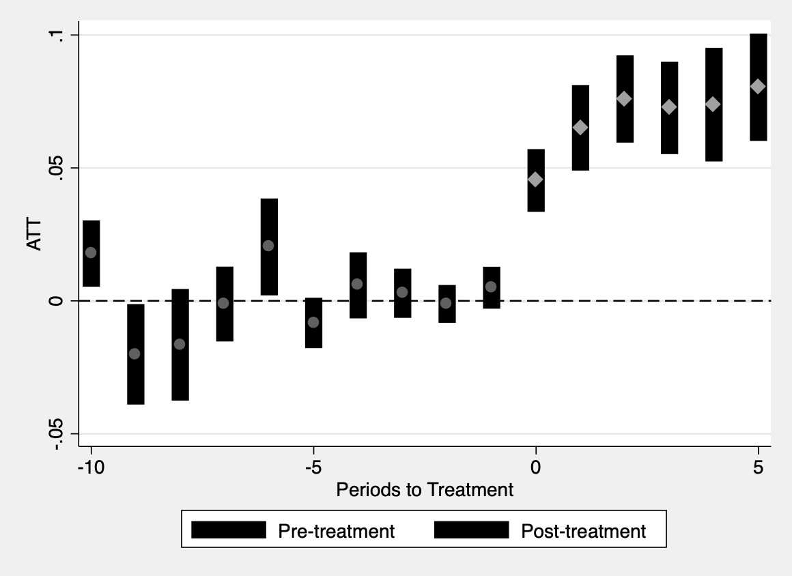
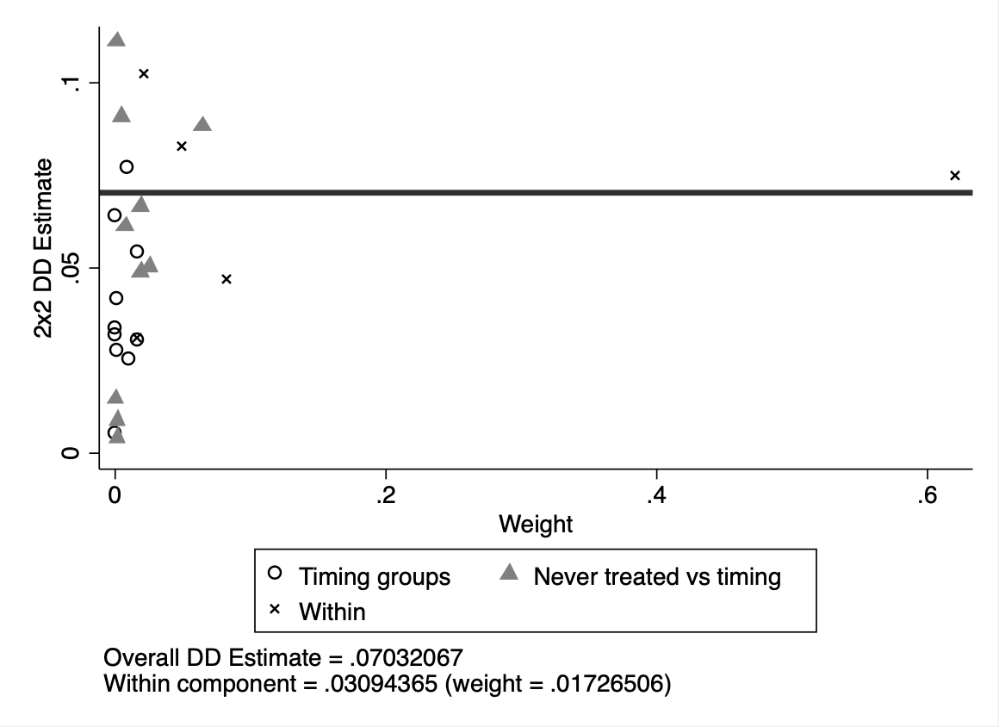
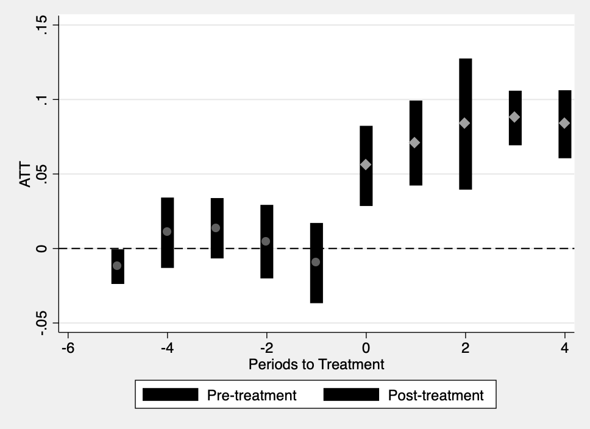
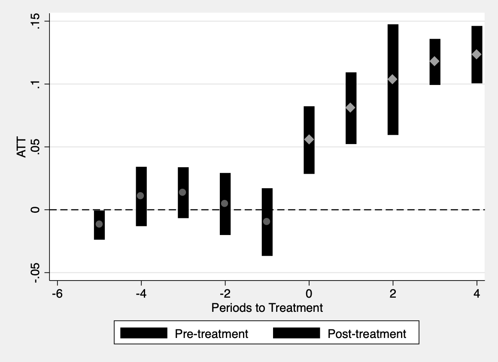

Medicaid Analysis Solution in Stata
================

## Introduction

This exercise will help you learn about the recent DiD literature on
settings with multiple periods and staggered treatment timing. We will
examine the effects of Medicaid expansions on insurance coverage using
publicly-available data from the ACS. This analysis is similar in spirit
to that in [Carey, Miller, and Wherry
(2020)](https://www.dropbox.com/s/mgunjcebpgnb939/Carey-et-al.pdf?dl=0),
although they use confidential data.

## Package Setup

For R, you will need the following packages: `did`, `dplyr`, `fixest`,
`bacondecomp`, `here`, and `haven`. For Stata, you will need `csdid`,
`drdid`, `reghdfe`, and `ddtiming`.

## Data

The provided datasets `ehec_data.dta` (for Stata) and `ehec_data.csv`
(for R) contain a state-level panel dataset on health insurance coverage
and Medicaid expansion. The variable `dins` shows the share of
low-income childless adults with health insurance in the state. The
variable `yexp2` gives the year that a state expanded Medicaid coverage
under the Affordable Care Act, and is missing if the state never
expanded. The variable `year` gives the year of the observation and the
variable `stfips` is a state identifier. (The variable `W` is the sum of
person-weights for the state in the ACS; for simplicity, we will treat
all states equally and ignore the weights, although if you’d like an
additional challenge feel free to re-do everything incorporating the
population weights!)

## Questions

1.  **Load the data**

Use the `haven::read_dta()` in R or `use` commands in Stata,
respectively, to load the relevant dataset.

``` stata
* ssc install csdid
* ssc install drdid
* ssc install reghdfe
* net install ddtiming, from(https://tgoldring.com/code/)

use "https://github.com/Mixtape-Sessions/Advanced-DID/raw/main/Exercises/Data/ehec_data.dta", clear
```

2.  **Estimate the ATT(g,t) using Callaway and Sant’Anna’s estimator**

Use the `attgt` function in the did package (R) or the `csdid` function
in the csdid package (Stata) to estimate the group-time specific ATTs
for the outcome `dins`. In R, I recommend using the control group option
“notyettreated”, which uses as a comparison group all units who are
not-yet-treated at a given period (including never-treated units). In
Stata, use the option `, notyet`. \[For fun, you’re welcome to also try
out using “nevertreated” units as the control\]. Hint: replace missing
values of `yexp2` to some large number (say, 3000) for the the did
package to incorporate the never-treated units as controls.

For R users, apply the `summary` command to the results from the
`att_gt` command. For Stata users, this should already be reported as a
result of `csdid` command (Note that the result labels are a bit weird,
not sure why. The first year reported is the correct $t$). After
applying the correct command, you should have a table with estimates of
the ATT(g,t) – that is, average treatment effects for a given “cohort”
first-treated in period g at each time t. For example, ATT(2014,2015)
gives the treatment effect in 2015 for the cohort first treated in 2014.

``` stata
replace yexp2 = 3000 if yexp2 == .
```

    (192 real changes made)

``` stata
csdid dins, ivar(stfips) time(year) gvar(yexp2) notyet
```

    .....xxxxxxxxxxx
    Difference-in-difference with Multiple Time Periods

                                                    Number of obs     =        552
    Outcome model  : weighted least squares
    Treatment model: inverse probability tilting
    ------------------------------------------------------------------------------
                 |      Coef.   Std. Err.      z    P>|z|     [95% Conf. Interval]
    -------------+----------------------------------------------------------------
    g2014        |
     t_2008_2009 |  -.0065141   .0048645    -1.34   0.181    -.0160484    .0030202
     t_2009_2010 |   .0111278   .0062139     1.79   0.073    -.0010512    .0233067
     t_2010_2011 |   .0015099   .0053645     0.28   0.778    -.0090043     .012024
     t_2011_2012 |   .0016101   .0059844     0.27   0.788    -.0101191    .0133394
     t_2012_2013 |   .0009286   .0066609     0.14   0.889    -.0121266    .0139838
     t_2013_2014 |   .0467024   .0083971     5.56   0.000     .0302444    .0631604
     t_2013_2015 |   .0692062   .0100181     6.91   0.000     .0495711    .0888412
     t_2013_2016 |   .0785134   .0102957     7.63   0.000     .0583341    .0986926
     t_2013_2017 |   .0725053   .0105766     6.86   0.000     .0517755     .093235
     t_2013_2018 |   .0738091   .0122118     6.04   0.000     .0498744    .0977438
     t_2013_2019 |   .0803199   .0102929     7.80   0.000     .0601461    .1004937
    -------------+----------------------------------------------------------------
    g2015        |
     t_2008_2009 |   .0040167   .0118351     0.34   0.734    -.0191797    .0272132
     t_2009_2010 |  -.0200514   .0109962    -1.82   0.068    -.0416036    .0015008
     t_2010_2011 |  -.0020254   .0069027    -0.29   0.769    -.0155544    .0115037
     t_2011_2012 |   .0011908   .0058021     0.21   0.837    -.0101812    .0125627
     t_2012_2013 |  -.0101459   .0110218    -0.92   0.357    -.0317481    .0114564
     t_2013_2014 |  -.0020446   .0066545    -0.31   0.759    -.0150871    .0109979
     t_2014_2015 |   .0490817   .0204309     2.40   0.016     .0090378    .0891256
     t_2014_2016 |   .0526184   .0137521     3.83   0.000     .0256647    .0795721
     t_2014_2017 |   .0681601   .0094088     7.24   0.000     .0497193    .0866009
     t_2014_2018 |   .0663169    .011487     5.77   0.000     .0438028    .0888311
     t_2014_2019 |   .0737712   .0111886     6.59   0.000     .0518419    .0957005
    -------------+----------------------------------------------------------------
    g2016        |
     t_2008_2009 |  -.0005613   .0066876    -0.08   0.933    -.0136688    .0125462
     t_2009_2010 |   .0570983   .0088296     6.47   0.000     .0397926    .0744039
     t_2010_2011 |  -.0271528   .0358967    -0.76   0.449     -.097509    .0432033
     t_2011_2012 |  -.0281349   .0416193    -0.68   0.499    -.1097072    .0534373
     t_2012_2013 |   .0456205   .0419522     1.09   0.277    -.0366042    .1278453
     t_2013_2014 |  -.0328754   .0446924    -0.74   0.462     -.120471    .0547202
     t_2014_2015 |   .0408757   .0169018     2.42   0.016     .0077488    .0740026
     t_2015_2016 |   .0316796   .0096854     3.27   0.001     .0126967    .0506625
     t_2015_2017 |   .0367972   .0083157     4.43   0.000     .0204987    .0530958
     t_2015_2018 |   .0645061   .0123882     5.21   0.000     .0402256    .0887866
     t_2015_2019 |    .082502   .0089256     9.24   0.000     .0650081    .0999958
    -------------+----------------------------------------------------------------
    g2017        |
     t_2008_2009 |   .0077524   .0044075     1.76   0.079    -.0008861     .016391
     t_2009_2010 |  -.0079563   .0057291    -1.39   0.165     -.019185    .0032725
     t_2010_2011 |   -.000317   .0040949    -0.08   0.938     -.008343    .0077089
     t_2011_2012 |   .0164156   .0042681     3.85   0.000     .0080504    .0247809
     t_2012_2013 |   .0049802     .00409     1.22   0.223    -.0030361    .0129965
     t_2013_2014 |  -.0099396   .0040498    -2.45   0.014     -.017877   -.0020021
     t_2014_2015 |   .0077381   .0061516     1.26   0.208    -.0043188    .0197951
     t_2015_2016 |   .0398369   .0052832     7.54   0.000     .0294821    .0501917
     t_2016_2017 |   .0471102   .0051327     9.18   0.000     .0370503      .05717
     t_2016_2018 |   .0680601   .0046726    14.57   0.000     .0589019    .0772182
     t_2016_2019 |   .0650109   .0037558    17.31   0.000     .0576496    .0723723
    -------------+----------------------------------------------------------------
    g2019        |
     t_2008_2009 |   .0177838   .0063595     2.80   0.005     .0053194    .0302483
     t_2009_2010 |  -.0201117    .009635    -2.09   0.037    -.0389961   -.0012274
     t_2010_2011 |  -.0286565   .0039841    -7.19   0.000    -.0364652   -.0208477
     t_2011_2012 |    .001542   .0164525     0.09   0.925    -.0307043    .0337882
     t_2012_2013 |   .0181727   .0072487     2.51   0.012     .0039655    .0323799
     t_2013_2014 |  -.0040733   .0061115    -0.67   0.505    -.0160517    .0079051
     t_2014_2015 |  -.0061766   .0088142    -0.70   0.483    -.0234521    .0110989
     t_2015_2016 |  -.0159999   .0210236    -0.76   0.447    -.0572054    .0252056
     t_2016_2017 |   .0092824   .0175495     0.53   0.597     -.025114    .0436787
     t_2017_2018 |   .0061906   .0061908     1.00   0.317    -.0059431    .0183242
     t_2018_2019 |   .0365442   .0051795     7.06   0.000     .0263925    .0466959
    -------------+----------------------------------------------------------------
    g3000        |
     t_2008_2009 |          0  (omitted)
     t_2009_2010 |          0  (omitted)
     t_2010_2011 |          0  (omitted)
     t_2011_2012 |          0  (omitted)
     t_2012_2013 |          0  (omitted)
     t_2013_2014 |          0  (omitted)
     t_2014_2015 |          0  (omitted)
     t_2015_2016 |          0  (omitted)
     t_2016_2017 |          0  (omitted)
     t_2017_2018 |          0  (omitted)
     t_2018_2019 |          0  (omitted)
    ------------------------------------------------------------------------------
    Control: Not yet Treated

    See Callaway and Sant'Anna (2021) for details

3.  **Compare to DiD estimates calculated by hand**

To understand how these ATT(g,t) estimates are constructed, we will
manually compute one of them by hand. For simplicity, let’s focus on
ATT(2014, 2014), the treatment effect for the first treated cohort
(2014) in the year that they’re treated (2014). Create an indicator
variable D for whether a unit is first-treated in 2014. Calculate the
conditional mean of `dins` for the years 2013 and 2014 for units with
D=1 and units with D=0 (i.e. calculate 4 means, for each combination of
year and D). Manually compute the 2x2 DiD between D=1 and D=0 and 2013
and 2014. If you did it right, this should line up exactly with the
ATT(g,t) estimate you got from the CS package! (Bonus: If you’re feeling
ambitious, you can verify by hand that the other ATT(g,t) estimates from
the CS package also correspond with simple 2x2 DiDs that you can compute
by hand)

``` stata
preserve

keep if year == 2013 | year == 2014
gen treated = (yexp2 == 2014)

// calculate means
sum dins if year == 2013 & treated == 0
loc dins_00 = r(mean)
sum dins if year == 2014 & treated == 0
loc dins_01 = r(mean)
sum dins if year == 2013 & treated == 1
loc dins_10 = r(mean)
sum dins if year == 2014 & treated == 1
loc dins_11 = r(mean)
loc att_2014_2014 = (`dins_11' - `dins_10') - (`dins_01' - `dins_00')
disp "ATT(2014, 2014): `att_2014_2014'"

restore
```

    (460 observations deleted)

        Variable |        Obs        Mean    Std. Dev.       Min        Max
    -------------+---------------------------------------------------------
            dins |         24    .6284768    .0463048   .5408732   .7232717

        Variable |        Obs        Mean    Std. Dev.       Min        Max
    -------------+---------------------------------------------------------
            dins |         24    .6730668       .0541    .531309   .7623242

        Variable |        Obs        Mean    Std. Dev.       Min        Max
    -------------+---------------------------------------------------------
            dins |         22    .6624221    .0584509   .5640745   .7820048

        Variable |        Obs        Mean    Std. Dev.       Min        Max
    -------------+---------------------------------------------------------
            dins |         22    .7537145    .0541891   .6353181   .8518662


    ATT(2014, 2014): .0467024296522141

4.  **Aggregate the ATT(g,t)**

We are often interested in a summary of the ATT(g,t)’s.

In R, use the `aggte` command with option `type = "dynamic"` to compute
“event-study” parameters. These are averages of the ATT(g,t) for cohorts
at a given lag from treatment — for example, the estimate for event-time
3 gives an average of parameters of the form ATT(g,g+3), i.e. treatment
effects 3 periods after units were first treated. You can use the
`ggdid` command to plot the relevant event-study.

In Stata, use the commands `qui: estat event` followed by `csdid_plot`.

You can also calculate overall summary parameters. E.g, in R, using
`aggte` with the option `type = "simple"` takes a simple weighted
average of the ATT(g,t), weighting proportional to cohort sizes. In
Stata, you can use `estat simple`.

``` stata
csdid dins, ivar(stfips) time(year) gvar(yexp2) notyet

qui: estat event
csdid_plot

estat simple
```

    .....xxxxxxxxxxx
    Difference-in-difference with Multiple Time Periods

                                                    Number of obs     =        552
    Outcome model  : weighted least squares
    Treatment model: inverse probability tilting
    ------------------------------------------------------------------------------
                 |      Coef.   Std. Err.      z    P>|z|     [95% Conf. Interval]
    -------------+----------------------------------------------------------------
    g2014        |
     t_2008_2009 |  -.0065141   .0048645    -1.34   0.181    -.0160484    .0030202
     t_2009_2010 |   .0111278   .0062139     1.79   0.073    -.0010512    .0233067
     t_2010_2011 |   .0015099   .0053645     0.28   0.778    -.0090043     .012024
     t_2011_2012 |   .0016101   .0059844     0.27   0.788    -.0101191    .0133394
     t_2012_2013 |   .0009286   .0066609     0.14   0.889    -.0121266    .0139838
     t_2013_2014 |   .0467024   .0083971     5.56   0.000     .0302444    .0631604
     t_2013_2015 |   .0692062   .0100181     6.91   0.000     .0495711    .0888412
     t_2013_2016 |   .0785134   .0102957     7.63   0.000     .0583341    .0986926
     t_2013_2017 |   .0725053   .0105766     6.86   0.000     .0517755     .093235
     t_2013_2018 |   .0738091   .0122118     6.04   0.000     .0498744    .0977438
     t_2013_2019 |   .0803199   .0102929     7.80   0.000     .0601461    .1004937
    -------------+----------------------------------------------------------------
    g2015        |
     t_2008_2009 |   .0040167   .0118351     0.34   0.734    -.0191797    .0272132
     t_2009_2010 |  -.0200514   .0109962    -1.82   0.068    -.0416036    .0015008
     t_2010_2011 |  -.0020254   .0069027    -0.29   0.769    -.0155544    .0115037
     t_2011_2012 |   .0011908   .0058021     0.21   0.837    -.0101812    .0125627
     t_2012_2013 |  -.0101459   .0110218    -0.92   0.357    -.0317481    .0114564
     t_2013_2014 |  -.0020446   .0066545    -0.31   0.759    -.0150871    .0109979
     t_2014_2015 |   .0490817   .0204309     2.40   0.016     .0090378    .0891256
     t_2014_2016 |   .0526184   .0137521     3.83   0.000     .0256647    .0795721
     t_2014_2017 |   .0681601   .0094088     7.24   0.000     .0497193    .0866009
     t_2014_2018 |   .0663169    .011487     5.77   0.000     .0438028    .0888311
     t_2014_2019 |   .0737712   .0111886     6.59   0.000     .0518419    .0957005
    -------------+----------------------------------------------------------------
    g2016        |
     t_2008_2009 |  -.0005613   .0066876    -0.08   0.933    -.0136688    .0125462
     t_2009_2010 |   .0570983   .0088296     6.47   0.000     .0397926    .0744039
     t_2010_2011 |  -.0271528   .0358967    -0.76   0.449     -.097509    .0432033
     t_2011_2012 |  -.0281349   .0416193    -0.68   0.499    -.1097072    .0534373
     t_2012_2013 |   .0456205   .0419522     1.09   0.277    -.0366042    .1278453
     t_2013_2014 |  -.0328754   .0446924    -0.74   0.462     -.120471    .0547202
     t_2014_2015 |   .0408757   .0169018     2.42   0.016     .0077488    .0740026
     t_2015_2016 |   .0316796   .0096854     3.27   0.001     .0126967    .0506625
     t_2015_2017 |   .0367972   .0083157     4.43   0.000     .0204987    .0530958
     t_2015_2018 |   .0645061   .0123882     5.21   0.000     .0402256    .0887866
     t_2015_2019 |    .082502   .0089256     9.24   0.000     .0650081    .0999958
    -------------+----------------------------------------------------------------
    g2017        |
     t_2008_2009 |   .0077524   .0044075     1.76   0.079    -.0008861     .016391
     t_2009_2010 |  -.0079563   .0057291    -1.39   0.165     -.019185    .0032725
     t_2010_2011 |   -.000317   .0040949    -0.08   0.938     -.008343    .0077089
     t_2011_2012 |   .0164156   .0042681     3.85   0.000     .0080504    .0247809
     t_2012_2013 |   .0049802     .00409     1.22   0.223    -.0030361    .0129965
     t_2013_2014 |  -.0099396   .0040498    -2.45   0.014     -.017877   -.0020021
     t_2014_2015 |   .0077381   .0061516     1.26   0.208    -.0043188    .0197951
     t_2015_2016 |   .0398369   .0052832     7.54   0.000     .0294821    .0501917
     t_2016_2017 |   .0471102   .0051327     9.18   0.000     .0370503      .05717
     t_2016_2018 |   .0680601   .0046726    14.57   0.000     .0589019    .0772182
     t_2016_2019 |   .0650109   .0037558    17.31   0.000     .0576496    .0723723
    -------------+----------------------------------------------------------------
    g2019        |
     t_2008_2009 |   .0177838   .0063595     2.80   0.005     .0053194    .0302483
     t_2009_2010 |  -.0201117    .009635    -2.09   0.037    -.0389961   -.0012274
     t_2010_2011 |  -.0286565   .0039841    -7.19   0.000    -.0364652   -.0208477
     t_2011_2012 |    .001542   .0164525     0.09   0.925    -.0307043    .0337882
     t_2012_2013 |   .0181727   .0072487     2.51   0.012     .0039655    .0323799
     t_2013_2014 |  -.0040733   .0061115    -0.67   0.505    -.0160517    .0079051
     t_2014_2015 |  -.0061766   .0088142    -0.70   0.483    -.0234521    .0110989
     t_2015_2016 |  -.0159999   .0210236    -0.76   0.447    -.0572054    .0252056
     t_2016_2017 |   .0092824   .0175495     0.53   0.597     -.025114    .0436787
     t_2017_2018 |   .0061906   .0061908     1.00   0.317    -.0059431    .0183242
     t_2018_2019 |   .0365442   .0051795     7.06   0.000     .0263925    .0466959
    -------------+----------------------------------------------------------------
    g3000        |
     t_2008_2009 |          0  (omitted)
     t_2009_2010 |          0  (omitted)
     t_2010_2011 |          0  (omitted)
     t_2011_2012 |          0  (omitted)
     t_2012_2013 |          0  (omitted)
     t_2013_2014 |          0  (omitted)
     t_2014_2015 |          0  (omitted)
     t_2015_2016 |          0  (omitted)
     t_2016_2017 |          0  (omitted)
     t_2017_2018 |          0  (omitted)
     t_2018_2019 |          0  (omitted)
    ------------------------------------------------------------------------------
    Control: Not yet Treated

    See Callaway and Sant'Anna (2021) for details


    (note:  named style % 40 not found in class color, default attributes used)
    (note:  named style % 40 not found in class color, default attributes used)
    (note:  named style % 40 not found in class color, default attributes used)
    (note:  named style % 40 not found in class color, default attributes used)
    (note:  named style % 40 not found in class color, default attributes used)
    (note:  named style % 40 not found in class color, default attributes used)
    (note:  named style % 40 not found in class color, default attributes used)
    (note:  named style % 40 not found in class color, default attributes used)
    (note:  named style % 40 not found in class color, default attributes used)
    (note:  named style % 40 not found in class color, default attributes used)

    (file es_plot.png written in PNG format)

    Average Treatment Effect on Treated
    ------------------------------------------------------------------------------
                 |      Coef.   Std. Err.      z    P>|z|     [95% Conf. Interval]
    -------------+----------------------------------------------------------------
             ATT |   .0679833   .0078313     8.68   0.000     .0526342    .0833323
    ------------------------------------------------------------------------------



5.  **Compare to TWFE estimates (part 1)**

Estimate the OLS regression specification

$$
Y_{it} = \alpha_i + \lambda_t + D_{it} \beta +\epsilon_{it},
$$

where $D_{it}$ is an indicator for whether unit $i$ was treated in
period $t$. How does the estimate for $\hat{\beta}$ compare to the
simple weighted average you got from Callaway and Sant’Anna? (Don’t
forget to cluster your SEs at the state level!)

``` stata
gen postTreated = year >= yexp2 & (yexp2 != 3000)

reghdfe dins i.postTreated, absorb(stfips year) vce(cluster stfips)
```

    (MWFE estimator converged in 2 iterations)

    HDFE Linear regression                            Number of obs   =        552
    Absorbing 2 HDFE groups                           F(   1,     45) =      90.28
    Statistics robust to heteroskedasticity           Prob > F        =     0.0000
                                                      R-squared       =     0.9447
                                                      Adj R-squared   =     0.9382
                                                      Within R-sq.    =     0.4267
    Number of clusters (stfips)  =         46         Root MSE        =     0.0223

                                     (Std. Err. adjusted for 46 clusters in stfips)
    -------------------------------------------------------------------------------
                  |               Robust
             dins |      Coef.   Std. Err.      t    P>|t|     [95% Conf. Interval]
    --------------+----------------------------------------------------------------
    1.postTreated |   .0703207    .007401     9.50   0.000     .0554143     .085227
            _cons |   .6794409   .0021452   316.72   0.000     .6751202    .6837616
    -------------------------------------------------------------------------------

    Absorbed degrees of freedom:
    -----------------------------------------------------+
     Absorbed FE | Categories  - Redundant  = Num. Coefs |
    -------------+---------------------------------------|
          stfips |        46          46           0    *|
            year |        12           0          12     |
    -----------------------------------------------------+
    * = FE nested within cluster; treated as redundant for DoF computation

6.  **Explain this result using the Bacon decomposition**

You probably noticed that the static TWFE estimate and the
simple-weighted average from C&S were fairly similar. The reason for
that is that in this example, there are a fairly large number of
never-treated units, and so TWFE mainly puts weight on “clean
comparisons”. We can see this by using the `Bacon decomposition`, which
shows how much weight static TWFE is putting on clean versus forbidden
comparisons. In R, use the `bacon()` command to estimate the weights
that TWFE puts on each of the types of comparisons. The first data-frame
returned by the command shows how much weight OLS put on the three types
of comparisons. In Stata, use the command `ddtiming`. How much weight is
put on forbidden comparisons here (i.e. comparisons of ‘Later vs
Earlier’)?

``` stata
xtset stfips year
```

           panel variable:  stfips (strongly balanced)
            time variable:  year, 2008 to 2019
                    delta:  1 unit

``` stata
ddtiming dins postTreated, i(stfips) t(year)
```

    Calculating treatment times...
    Calculating weights...
    Estimating 2x2 diff-in-diff regressions...

    Diff-in-diff estimate: 0.070    

    DD Comparison              Weight      Avg DD Est
    -------------------------------------------------
    Earlier T vs. Later C       0.149           0.070
    Later T vs. Earlier C       0.058           0.045
    T vs. Never treated         0.793           0.072
    -------------------------------------------------
    T = Treatment; C = Comparison

    (file bacon_decomp.png written in PNG format)



7.  **Compare to TWFE estimates (part 2)**

To see a situation where negative weights can matter (somewhat) more,
drop from your dataset all the observations that are never-treated.
Re-run the Callaway and Sant’Anna and TWFE estimates like you did before
on this modified data-set. How does the TWFE estimate compare to the
simple weighted average (or the average of the event-study coefficients)
now?

``` stata
drop if yexp2 == 3000
qui: csdid dins, ivar(stfips) time(year) gvar(yexp2) notyet
```

    (192 observations deleted)

``` stata
qui: estat event
csdid_plot
```

    (note:  named style % 40 not found in class color, default attributes used)
    (note:  named style % 40 not found in class color, default attributes used)
    (note:  named style % 40 not found in class color, default attributes used)
    (note:  named style % 40 not found in class color, default attributes used)
    (note:  named style % 40 not found in class color, default attributes used)
    (note:  named style % 40 not found in class color, default attributes used)
    (note:  named style % 40 not found in class color, default attributes used)
    (note:  named style % 40 not found in class color, default attributes used)
    (note:  named style % 40 not found in class color, default attributes used)
    (note:  named style % 40 not found in class color, default attributes used)

    (file es_plot_no_nevertreated.png written in PNG format)



``` stata
estat simple

reghdfe dins i.postTreated, absorb(stfips year) vce(cluster stfips)
```

    Average Treatment Effect on Treated
    ------------------------------------------------------------------------------
                 |      Coef.   Std. Err.      z    P>|z|     [95% Conf. Interval]
    -------------+----------------------------------------------------------------
             ATT |   .0761381   .0107013     7.11   0.000      .055164    .0971123
    ------------------------------------------------------------------------------

    (MWFE estimator converged in 2 iterations)

    HDFE Linear regression                            Number of obs   =        360
    Absorbing 2 HDFE groups                           F(   1,     29) =      67.38
    Statistics robust to heteroskedasticity           Prob > F        =     0.0000
                                                      R-squared       =     0.9421
                                                      Adj R-squared   =     0.9345
                                                      Within R-sq.    =     0.2005
    Number of clusters (stfips)  =         30         Root MSE        =     0.0241

                                     (Std. Err. adjusted for 30 clusters in stfips)
    -------------------------------------------------------------------------------
                  |               Robust
             dins |      Coef.   Std. Err.      t    P>|t|     [95% Conf. Interval]
    --------------+----------------------------------------------------------------
    1.postTreated |   .0628173   .0076528     8.21   0.000     .0471656    .0784691
            _cons |   .6939667   .0034012   204.03   0.000     .6870104     .700923
    -------------------------------------------------------------------------------

    Absorbed degrees of freedom:
    -----------------------------------------------------+
     Absorbed FE | Categories  - Redundant  = Num. Coefs |
    -------------+---------------------------------------|
          stfips |        30          30           0    *|
            year |        12           0          12     |
    -----------------------------------------------------+
    * = FE nested within cluster; treated as redundant for DoF computation

8.  **Run the Bacon decomposition (part 2)**

Re-run the Bacon decomposition on the modified dataset. How much weight
is put on “forbidden comparisons” now?

``` stata
ddtiming dins postTreated, i(stfips) t(year)
```

    Calculating treatment times...
    Calculating weights...
    Estimating 2x2 diff-in-diff regressions...

    Diff-in-diff estimate: 0.063    

    DD Comparison              Weight      Avg DD Est
    -------------------------------------------------
    Earlier T vs. Later C       0.719           0.070
    Later T vs. Earlier C       0.281           0.045
    -------------------------------------------------
    T = Treatment; C = Comparison

    (file bacon_decomp_no_nevertreated.png written in PNG format)


9.  **Even bigger TWFE problems**

In the last question, you saw an example where TWFE put a lot of weight
on “forbidden comparisons”. However, the estimates from the forbidden
comparisons were not so bad because the treatment effects were
relatively stable over time (the post-treatment event-study coefficients
are fairly flat). To see how dynamic treatment effects can make the
problem worse, create a variable `relativeTime` that gives the number of
periods since a unit has been treated. Create a new outcome variable
`dins2` that adds 0.01 times `relativeTime` to `dins` for observations
that have already been treated (i.e., we add in some dynamic treatment
effects that increase by 0.01 in each period after a unit is treated).
Re-run the Callaway & Sant’Anna and TWFE estimates and the Bacon decomp
using the dataset from the previous question and the `dins2` variable.
How do the differences between C&S and TWFE compare to before?

``` stata
gen relativeTime = year - yexp2
replace relativeTime = . if yexp2 == 3000
gen dins2 = dins + (relativeTime>0) * relativeTime * 0.01
```

    (0 real changes made)

``` stata
qui: csdid dins2, ivar(stfips) time(year) gvar(yexp2) notyet
estat simple

qui: estat event
csdid_plot
```

    Average Treatment Effect on Treated
    ------------------------------------------------------------------------------
                 |      Coef.   Std. Err.      z    P>|z|     [95% Conf. Interval]
    -------------+----------------------------------------------------------------
             ATT |   .0961381   .0107013     8.98   0.000      .075164    .1171123
    ------------------------------------------------------------------------------


    (note:  named style % 40 not found in class color, default attributes used)
    (note:  named style % 40 not found in class color, default attributes used)
    (note:  named style % 40 not found in class color, default attributes used)
    (note:  named style % 40 not found in class color, default attributes used)
    (note:  named style % 40 not found in class color, default attributes used)
    (note:  named style % 40 not found in class color, default attributes used)
    (note:  named style % 40 not found in class color, default attributes used)
    (note:  named style % 40 not found in class color, default attributes used)
    (note:  named style % 40 not found in class color, default attributes used)
    (note:  named style % 40 not found in class color, default attributes used)

    (file es_plot_dynamic.png written in PNG format)



``` stata
reghdfe dins2 i.postTreated, absorb(stfips year) vce(cluster stfips)
```

    (MWFE estimator converged in 2 iterations)

    HDFE Linear regression                            Number of obs   =        360
    Absorbing 2 HDFE groups                           F(   1,     29) =      43.26
    Statistics robust to heteroskedasticity           Prob > F        =     0.0000
                                                      R-squared       =     0.9479
                                                      Adj R-squared   =     0.9410
                                                      Within R-sq.    =     0.2004
    Number of clusters (stfips)  =         30         Root MSE        =     0.0256

                                     (Std. Err. adjusted for 30 clusters in stfips)
    -------------------------------------------------------------------------------
                  |               Robust
            dins2 |      Coef.   Std. Err.      t    P>|t|     [95% Conf. Interval]
    --------------+----------------------------------------------------------------
    1.postTreated |   .0666631    .010135     6.58   0.000     .0459347    .0873915
            _cons |   .7026741   .0045044   156.00   0.000     .6934615    .7118867
    -------------------------------------------------------------------------------

    Absorbed degrees of freedom:
    -----------------------------------------------------+
     Absorbed FE | Categories  - Redundant  = Num. Coefs |
    -------------+---------------------------------------|
          stfips |        30          30           0    *|
            year |        12           0          12     |
    -----------------------------------------------------+
    * = FE nested within cluster; treated as redundant for DoF computation

``` stata
ddtiming dins2 postTreated, i(stfips) t(year)
```

    Calculating treatment times...
    Calculating weights...
    Estimating 2x2 diff-in-diff regressions...

    Diff-in-diff estimate: 0.067    

    DD Comparison              Weight      Avg DD Est
    -------------------------------------------------
    Earlier T vs. Later C       0.719           0.082
    Later T vs. Earlier C       0.281           0.028
    -------------------------------------------------
    T = Treatment; C = Comparison

    (file bacon_decomposition_dynamic.png written in PNG format)
