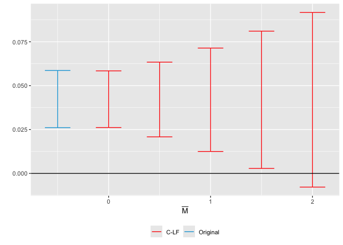

Mixtape-Exercises-Violations of PT
================
2022-06-23

## Introduction

This exercise will walk you through using the HonestDiD R or Stata
package to conduct sensitivity analysis for possible violations of
parallel trends, using the methods proposed in [Rambachan and Roth
(2022)](https://jonathandroth.github.io/assets/files/HonestParallelTrends_Main.pdf).
Here are links to the [Stata
package](https://github.com/mcaceresb/stata-honestdid) and [R
package](https://github.com/asheshrambachan/HonestDiD).

## 0. Install packages if needed

We will use several R packages in our analysis, which you can install as
follows if needed.

``` r
# Install here, dplyr, did, haven, ggplot2, remotes packages from CRAN
install.packages(c("here", "dplyr", "did", "haven", "ggplot2", "remotes", "fixest"))

# Turn off warning-error-conversion, because the tiniest warning stops installation
Sys.setenv("R_REMOTES_NO_ERRORS_FROM_WARNINGS" = "true")
# Install HonestDiD from github
remotes::install_github("asheshrambachan/HonestDiD")
```

## 1. Run the baseline DiD

For simplicity, we will first focus on assessing sensitivity to
violations of parallel trends in a non-staggered DiD. Load the same
dataset on Medicaid as in the previous exercise. Restrict the sample to
the years 2015 and earlier, drop the small number of units who are first
treated in 2015. We are now left with a panel dataset where some units
are first treated in 2014 and the remaining units are not treated during
the sample period.

``` r
library(here)
library(dplyr)
library(did)
library(haven)
library(ggplot2)
library(HonestDiD)
df <- read_dta("https://raw.githubusercontent.com/Mixtape-Sessions/Advanced-DID/main/Exercises/Data/ehec_data.dta")

# Keep years before 2016. Drop the 2016 cohort
df_nonstaggered <- df %>%
  filter(year <= 2015) %>%
  filter(is.na(yexp2) | yexp2 < 2015)

# Create a treatment dummy
df_nonstaggered <- df_nonstaggered %>%
  mutate(
    D = ifelse(is.na(yexp2), 0, 1)
  )
```

Start by running the simple TWFE regression
$Y_{it} = \alpha_i + \lambda_t + \sum_{s \neq 2013} 1[s=t] \times D_i \times \beta_s + u_{it} ,$
where $D_i =1$ if a unit is first treated in 2014 and 0 otherwise. Note
that since we do not have staggered treatment, the coefficients
$\hat{\beta}_s$ are equivalent to DiD estimates between the treated and
non-treated units between period $s$ and 2013. I recommend using the
`feols` command from the `fixest` package in R and `reghdfe` command in
Stata; although feel free to use your favorite regression command. Don’t
forget to cluster your SEs at the state level.

``` r
library(fixest)
twfe_results <- feols(dins ~ i(year, D, ref = 2013) | stfips + year,
  cluster = "stfips",
  data = df_nonstaggered
)
twfe_results_summary <- summary(twfe_results)
iplot(twfe_results)
```

<!-- -->

## 2. Extract the coefficients and standard error from the baseline spec

*NOTE: R only*

To conduct sensitivity analysis using the `HonestDiD` package, we need
to extract the event-study coefficients and their variance-covariance
matrix. (Note: the event-study coefficients are assumed to be in order
from earliest to latest.) If you estimated the coefficients using
`feols` from the `fixest` package, it is easy to extract these objects
from the summary command. In particular, if your `feols` results are
stored in `twfe_results`, you can use the commands:

``` r
betahat <- summary(twfe_results)$coefficients
sigma <- summary(twfe_results)$cov.scaled
```

## 3. Sensitivity analysis using relative magnitudes restrictions

We are now ready to apply the HonestDiD package to do sensitivity
analysis. Suppose we’re interested in assessing the sensitivity of the
estimate for 2014 (the first year of treatment). We will use the
“relative magnitudes” restriction that allows the violation of parallel
trends between 2013 and 2014 to be no more than $\bar{M}$ times larger
than the worst pre-treatment violation of parallel trends.

To create a sensitivity analysis, load the `HonestDiD` package, and call
the `createSensitivityResults_relativeMagnitudes` function. You will
need to input the parameters `betahat` and `sigma` calculated above,
`numPrePeriods` (in this case, 5), and `numPostPeriods` (in this case,
2). I suggest that you also give the optional parameter
`Mbarvec = seq(0,2,by=0.5)` to specify the values of $\bar{M}$ you wish
to use. (Note: it may take a couple of minutes to calculate the
sensitivity results.)

``` r
delta_rm_results <-
  HonestDiD::createSensitivityResults_relativeMagnitudes(
    betahat = betahat,
    sigma = sigma,
    numPrePeriods = 5,
    numPostPeriods = 2, Mbarvec = seq(0, 2, by = 0.5),
    l_vec = basisVector(index = 1, size = 2)
  )

delta_rm_results
```

    ## # A tibble: 5 × 5
    ##         lb    ub method Delta    Mbar
    ##      <dbl> <dbl> <chr>  <chr>   <dbl>
    ## 1  0.0190  0.100 C-LF   DeltaRM   0  
    ## 2  0.00296 0.120 C-LF   DeltaRM   0.5
    ## 3 -0.0190  0.148 C-LF   DeltaRM   1  
    ## 4 -0.0410  0.175 C-LF   DeltaRM   1.5
    ## 5 -0.0647  0.202 C-LF   DeltaRM   2

Look at the results of the sensitivity analysis you created. For each
value of $\bar{M}$, it gives a robust confidence interval that allows
for violations of parallel trends between 2013 and 2014 to be no more
than $\bar{M}$ times the max pre-treatment violation of parallel trends.
What is the “breakdown” value of $\bar{M}$ at which we can no longer
reject a null effect? Interpret this parameter.

## 4. Create a sensitivity analysis plot

We can also visualize the sensitivity analysis using the
`createSensitivityPlot_relativeMagnitudes`. To do this, we first have to
calculate the CI for the original OLS estimates using the
`constructOriginalCS` command. We then pass our sensitivity analysis and
the original results to the `createSensitivityPlot_relativeMagnitudes`
command.

``` r
originalResults <- HonestDiD::constructOriginalCS(
  betahat = betahat,
  sigma = sigma,
  numPrePeriods = 5,
  numPostPeriods = 2
)

HonestDiD::createSensitivityPlot_relativeMagnitudes(delta_rm_results, originalResults)
```

<!-- -->

## 5. Sensitivity Analysis Using Smoothness Bounds

We can also do a sensitivity analysis based on different restrictions on
what violations of parallel trends might look like. The starting point
for this analysis is that often if we’re worried about violations of
parallel trends, we let treated units be on a different time-trend
relative to untreated units. Rambachan and Roth consider a sensitivity
analysis based on this idea – how much would the difference in trends
need to differ from linearity to violate a particular result?
Specifically, they introduce a parameter $M$ that says that the change
in the slope of the trend can be no more than $M$ between consecutive
periods.

Use the function `createSensitivityPlot` to run a sensitivity analysis
using this smoothness bound. The inputs are similar to those for the
previous analysis, except instead of inputting `Mbarvec`, set the
parameter `Mvec = seq(from = 0, to = 0.05, by =0.01)`. (Note: as before
it may take a couple of minutes for the sensitivity code to run.) What
is the breakdown value of $M$ – that is, how non-linear would the
difference in trends have to be for us not to reject a significant
effect?

``` r
delta_sd_results <-
  HonestDiD::createSensitivityResults(
    betahat = betahat,
    sigma = sigma,
    numPrePeriods = 5,
    numPostPeriods = 2,
    Mvec = seq(from = 0, to = 0.05, by = 0.01)
  )

delta_sd_results
```

    ## # A tibble: 6 × 5
    ##           lb     ub method Delta       M
    ##        <dbl>  <dbl> <chr>  <chr>   <dbl>
    ## 1  0.0436    0.0844 FLCI   DeltaSD  0   
    ## 2  0.0225    0.100  FLCI   DeltaSD  0.01
    ## 3 -0.0000675 0.116  FLCI   DeltaSD  0.02
    ## 4 -0.0179    0.135  FLCI   DeltaSD  0.03
    ## 5 -0.0334    0.154  FLCI   DeltaSD  0.04
    ## 6 -0.0467    0.174  FLCI   DeltaSD  0.05

``` r
createSensitivityPlot(delta_sd_results, originalResults)
```

<!-- -->

## 6. Bonus: Sensitivity Analysis for Average Effects

Re-run the sensitivity analyses above using the option
`l_vec = c(0.5,0.5)` to do sensitivity on the `average` effect between
2014 and 2015 rather than the effect for 2014 (`l_vec = c(0,1)` would
give inference on the 2015 effect). How do the breakdown values of
$\bar{M}$ and $M$ compare to those for the effect in 2014? \[Hint:
breakdown values for longer-run effects often tend to be smaller, since
this leaves more time for the groups’ trends to diverge from each
other.\]

``` r
delta_rm_results_avg <-
  HonestDiD::createSensitivityResults_relativeMagnitudes(
    betahat = betahat,
    sigma = sigma,
    numPrePeriods = 5,
    numPostPeriods = 2, Mbarvec = seq(0, 2, by = 0.5),
    l_vec = c(0.5, 0.5)
  )

delta_sd_results_avg <-
  HonestDiD::createSensitivityResults(
    betahat = betahat,
    sigma = sigma,
    numPrePeriods = 5,
    numPostPeriods = 2, Mvec = seq(0, 0.05, by = 0.01),
    l_vec = c(0.5, 0.5)
  )

originalResults_avg <- HonestDiD::constructOriginalCS(
  betahat = betahat,
  sigma = sigma,
  numPrePeriods = 5,
  numPostPeriods = 2,
  l_vec = c(0.5, 0.5)
)

createSensitivityPlot_relativeMagnitudes(delta_rm_results_avg, originalResults_avg)
```

<!-- -->

``` r
createSensitivityPlot(delta_sd_results_avg, originalResults_avg)
```

<!-- -->

## 7. Bonus 2: HonestDiD + Callaway & Sant’Anna

Look at the instructions
[here](https://github.com/asheshrambachan/HonestDiD#staggered-timing)
for running an event-study using Callaway and Sant’Anna and passing the
results to the HonestDiD package for sensitivity analysis. Create a
Callaway and Sant’Anna event-study using the full Medicaid data, and
then apply the HonestDiD sensitivity. \[Hint: I recommend using
`min_e = -5` and `max_e = 5` in the `aggte` command, since the earlier
pre-trends coefficients are very noisy.\]

``` r
### First, we import the function Pedro created ####

#' @title honest_did
#'
#' @description a function to compute a sensitivity analysis
#'  using the approach of Rambachan and Roth (2021)
#' @param es an event study
honest_did <- function(es, ...) {
  UseMethod("honest_did", es)
}


#' @title honest_did.AGGTEobj
#'
#' @description a function to compute a sensitivity analysis
#'  using the approach of Rambachan and Roth (2021) when
#'  the event study is estimating using the `did` package
#'
#' @param e event time to compute the sensitivity analysis for.
#'  The default value is `e=0` corresponding to the "on impact"
#'  effect of participating in the treatment.
#' @param type Options are "smoothness" (which conducts a
#'  sensitivity analysis allowing for violations of linear trends
#'  in pre-treatment periods) or "relative_magnitude" (which
#'  conducts a sensitivity analysis based on the relative magnitudes
#'  of deviations from parallel trends in pre-treatment periods).
#' @inheritParams HonestDiD::createSensitivityResults
#' @inheritParams HonestDid::createSensitivityResults_relativeMagnitudes
honest_did.AGGTEobj <- function(es,
                                e=0,
                                type=c("smoothness", "relative_magnitude"),
                                method=NULL,
                                bound="deviation from parallel trends",
                                Mvec=NULL,
                                Mbarvec=NULL,
                                monotonicityDirection=NULL,
                                biasDirection=NULL,
                                alpha=0.05,
                                parallel=FALSE,
                                gridPoints=10^3,
                                grid.ub=NA,
                                grid.lb=NA,
                                ...) {
  
  
  type <- type[1]
  
  # make sure that user is passing in an event study
  if (es$type != "dynamic") {
    stop("need to pass in an event study")
  }
  
  # check if used universal base period and warn otherwise
  if (es$DIDparams$base_period != "universal") {
    stop("Use a universal base period for honest_did")
  }
  
  # recover influence function for event study estimates
  es_inf_func <- es$inf.function$dynamic.inf.func.e
  
  # recover variance-covariance matrix
  n <- nrow(es_inf_func)
  V <- t(es_inf_func) %*% es_inf_func / (n*n) 
  
  #Remove the coefficient normalized to zero
  referencePeriodIndex <- which(es$egt == -1)
  V <- V[-referencePeriodIndex,-referencePeriodIndex]
  beta <- es$att.egt[-referencePeriodIndex]
  
  nperiods <- nrow(V) 
  npre <- sum(1*(es$egt < -1))
  npost <- nperiods - npre
  
  baseVec1 <- basisVector(index=(e+1),size=npost)
  
  orig_ci <- constructOriginalCS(betahat = beta,
                                 sigma = V, numPrePeriods = npre,
                                 numPostPeriods = npost,
                                 l_vec = baseVec1)
  
  if (type=="relative_magnitude") {
    if (is.null(method)) method <- "C-LF"
    robust_ci <- createSensitivityResults_relativeMagnitudes(betahat = beta, sigma = V, 
                                                             numPrePeriods = npre, 
                                                             numPostPeriods = npost,
                                                             bound=bound,
                                                             method=method,
                                                             l_vec = baseVec1,
                                                             Mbarvec = Mbarvec,
                                                             monotonicityDirection=monotonicityDirection,
                                                             biasDirection=biasDirection,
                                                             alpha=alpha,
                                                             gridPoints=100,
                                                             parallel=parallel)
    
  } else if (type=="smoothness") {
    robust_ci <- createSensitivityResults(betahat = beta,
                                          sigma = V, 
                                          numPrePeriods = npre, 
                                          numPostPeriods = npost,
                                          method=method,
                                          l_vec = baseVec1,
                                          monotonicityDirection=monotonicityDirection,
                                          biasDirection=biasDirection,
                                          alpha=alpha,
                                          parallel=parallel)
  }
  
  return(list(robust_ci=robust_ci, orig_ci=orig_ci, type=type))
}

###

# Run the CS event-study with 'universal' base-period
cs_results <- att_gt(yname = "dins",
                     tname = "year",
                     idname = "stfips", 
                     gname = "yexp2", 
                     data = df %>% mutate(yexp2 = ifelse(is.na(yexp2), 3000, yexp2)),
                     control_group = "notyettreated",
                     base_period = "universal")

es <- aggte(cs_results, type = "dynamic", 
            min_e = -5, max_e = 5)

# Run sensitivity analysis for relative magnitudes 
sensitivity_results <-
  honest_did.AGGTEobj(es,
                      e =0,
                      type = "relative_magnitude",
                      Mbarvec = seq(from = 0.5, to = 2, by = 0.5))

createSensitivityPlot_relativeMagnitudes(sensitivity_results$robust_ci,
                                         sensitivity_results$orig_ci)
```

<!-- -->
