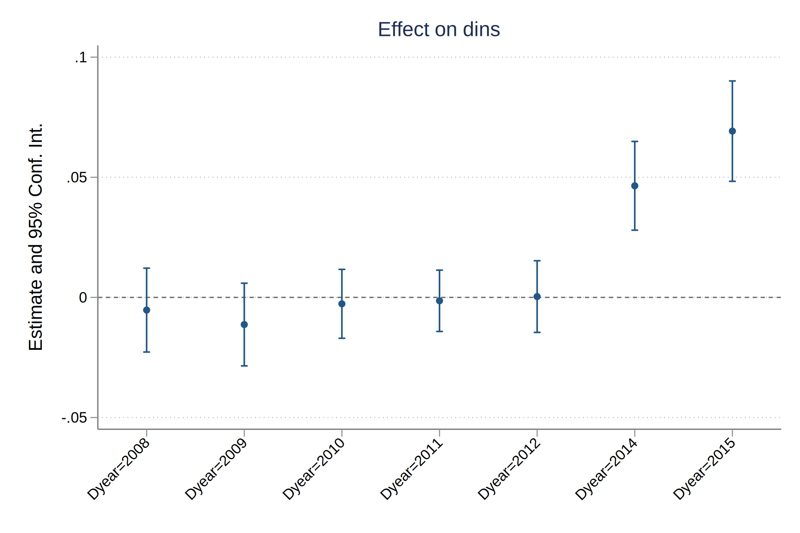
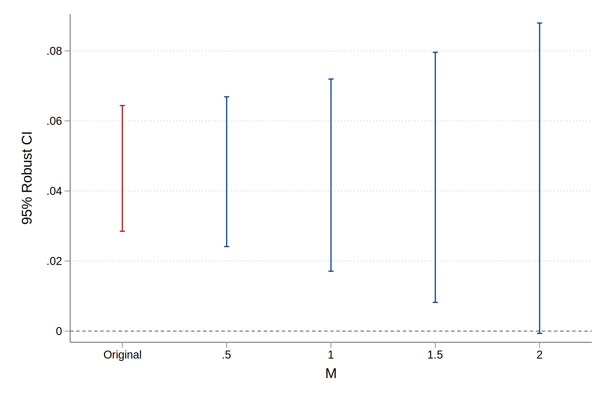
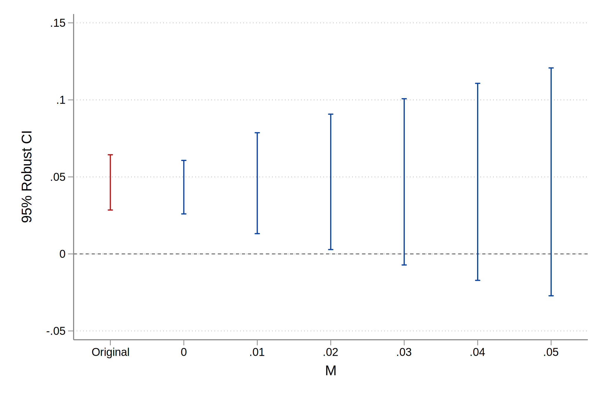
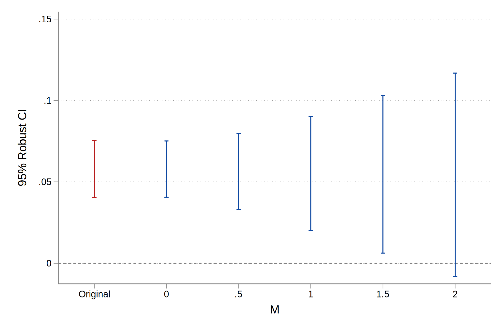
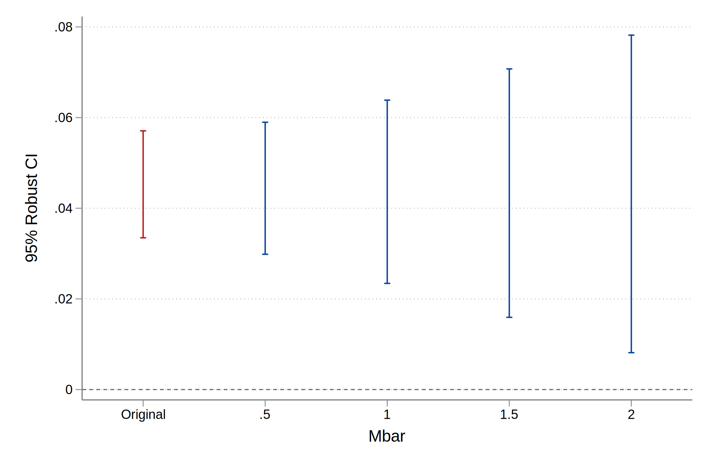

Mixtape-Exercises-Violations of PT
================
2022-06-23

## Introduction

This exercise will walk you through using the HonestDiD R or Stata
package to conduct sensitivity analysis for possible violations of
parallel trends, using the methods proposed in [Rambachan and Roth
(2022)](https://jonathandroth.github.io/assets/files/HonestParallelTrends_Main.pdf).
Here are links to the [Stata
package](https://github.com/mcaceresb/stata-honestdid) and [R
package](https://github.com/asheshrambachan/HonestDiD).

## 0. Install packages if needed

We will use several Stata packages in our analysis, which you can
install as follows if needed.

``` stata
* reghdfe
ssc install reghdfe

* honestdid
net install honestdid, from("https://raw.githubusercontent.com/mcaceresb/stata-honestdid/main") replace
honestdid _plugin_check

* csdid 
net install csdid, from ("https://raw.githubusercontent.com/friosavila/csdid_drdid/main/code/") replace
```

## 1. Run the baseline DiD

For simplicity, we will first focus on assessing sensitivity to
violations of parallel trends in a non-staggered DiD. Load the same
dataset on Medicaid as in the previous exercise. Restrict the sample to
the years 2015 and earlier, drop the small number of units who are first
treated in 2015. We are now left with a panel dataset where some units
are first treated in 2014 and the remaining units are not treated during
the sample period.

``` stata
use "https://raw.githubusercontent.com/Mixtape-Sessions/Advanced-DID/main/Exercises/Data/ehec_data.dta", clear

* Keep years before 2016. Drop the 2016 cohort
keep if (year < 2016) & (missing(yexp2) | (yexp2 != 2015))

* Create a treatment dummy
gen D = (yexp2 == 2014)
gen Dyear = cond(D, year, 2013)
```

    (208 observations deleted)

Start by running the simple TWFE regression
$Y_{it} = \alpha_i + \lambda_t + \sum_{s \neq 2013} 1[s=t] \times D_i \times \beta_s + u_{it} ,$
where $D_i =1$ if a unit is first treated in 2014 and 0 otherwise. Note
that since we do not have staggered treatment, the coefficients
$\hat{\beta}_s$ are equivalent to DiD estimates between the treated and
non-treated units between period $s$ and 2013. I recommend using the
`feols` command from the `fixest` package in R and `reghdfe` command in
Stata; although feel free to use your favorite regression command. Don’t
forget to cluster your SEs at the state level.

``` stata
* Run the TWFE spec
reghdfe dins b2013.Dyear, absorb(stfips year) cluster(stfips) noconstant

coefplot, vertical yline(0) ciopts(recast(rcap)) xlabel(,angle(45)) ytitle("Estimate and 95% Conf. Int.") title("Effect on dins")
```

    (MWFE estimator converged in 2 iterations)

    HDFE Linear regression                            Number of obs   =        344
    Absorbing 2 HDFE groups                           F(   7,     42) =      10.15
    Statistics robust to heteroskedasticity           Prob > F        =     0.0000
                                                      R-squared       =     0.9464
                                                      Adj R-squared   =     0.9357
                                                      Within R-sq.    =     0.3726
    Number of clusters (stfips)  =         43         Root MSE        =     0.0194

                                    (Std. Err. adjusted for 43 clusters in stfips)
    ------------------------------------------------------------------------------
                 |               Robust
            dins |      Coef.   Std. Err.      t    P>|t|     [95% Conf. Interval]
    -------------+----------------------------------------------------------------
           Dyear |
           2008  |  -.0052854   .0086536    -0.61   0.545     -.022749    .0121783
           2009  |  -.0112973   .0085244    -1.33   0.192    -.0285002    .0059056
           2010  |   -.002676   .0071078    -0.38   0.708    -.0170201    .0116681
           2011  |  -.0014193   .0063271    -0.22   0.824    -.0141879    .0113493
           2012  |   .0003397    .007391     0.05   0.964    -.0145759    .0152553
           2014  |   .0464469   .0091519     5.08   0.000     .0279776    .0649161
           2015  |   .0692062     .01035     6.69   0.000     .0483189    .0900934
    ------------------------------------------------------------------------------

    Absorbed degrees of freedom:
    -----------------------------------------------------+
     Absorbed FE | Categories  - Redundant  = Num. Coefs |
    -------------+---------------------------------------|
          stfips |        43          43           0    *|
            year |         8           0           8     |
    -----------------------------------------------------+
    * = FE nested within cluster; treated as redundant for DoF computation

<figure>

<figcaption aria-hidden="true">TWFE Estimates</figcaption>
</figure>

## 3. Sensitivity analysis using relative magnitudes restrictions

We are now ready to apply the HonestDiD package to do sensitivity
analysis. Suppose we’re interested in assessing the sensitivity of the
estimate for 2014 (the first year of treatment). We will use the
“relative magnitudes” restriction that allows the violation of parallel
trends between 2013 and 2014 to be no more than $\bar{M}$ times larger
than the worst pre-treatment violation of parallel trends.

To create a sensitivity analysis, use the `honestdid` function. You will
need to pass the options `pre` and `post` to specify the pre and post
treatment estimates. I suggest that you also give the optional parameter
`mvec` a value of `0.5(0.5)2` to specify the values of $\bar{M}$ you
wish to use. (Note: it may take a couple of minutes to calculate the
sensitivity results.)

``` stata
honestdid, pre(1/5) post(7/8) mvec(0.5(0.5)2)
```

    |    M    |   lb   |   ub   |
    | ------- | ------ | ------ |
    |       . |  0.029 |  0.064 | (Original)
    |  0.5000 |  0.024 |  0.067 | 
    |  1.0000 |  0.017 |  0.072 | 
    |  1.5000 |  0.008 |  0.080 | 
    |  2.0000 | -0.001 |  0.088 | 
    (method = C-LF, Delta = DeltaRM, alpha = 0.050)

Look at the results of the sensitivity analysis you created. For each
value of $\bar{M}$, it gives a robust confidence interval that allows
for violations of parallel trends between 2013 and 2014 to be no more
than $\bar{M}$ times the max pre-treatment violation of parallel trends.
What is the “breakdown” value of $\bar{M}$ at which we can no longer
reject a null effect? Interpret this parameter.

## 4. Create a sensitivity analysis plot

We can also visualize the sensitivity analysis using the `honestdid`
command by adding the `coefplot` option. You can use the `cached` option
to use the results from the previous `honestdid` call (for speed’s
sake).

``` stata
honestdid, pre(1/5) post(7/8) mvec(0.5(0.5)2) coefplot xtitle("M") ytitle("95% Robust CI")
```

    |    M    |   lb   |   ub   |
    | ------- | ------ | ------ |
    |       . |  0.029 |  0.064 | (Original)
    |  0.5000 |  0.024 |  0.067 | 
    |  1.0000 |  0.017 |  0.072 | 
    |  1.5000 |  0.008 |  0.080 | 
    |  2.0000 | -0.001 |  0.088 | 
    (method = C-LF, Delta = DeltaRM, alpha = 0.050)

<figure>

<figcaption aria-hidden="true">Sensitivity Analysis using Assumptions on
the Relative Magnitude</figcaption>
</figure>

## 5. Sensitivity Analysis Using Smoothness Bounds

We can also do a sensitivity analysis based on different restrictions on
what violations of parallel trends might look like. The starting point
for this analysis is that often if we’re worried about violations of
parallel trends, we let treated units be on a different time-trend
relative to untreated units. Rambachan and Roth consider a sensitivity
analysis based on this idea – how much would the difference in trends
need to differ from linearity to violate a particular result?
Specifically, they introduce a parameter $M$ that says that the change
in the slope of the trend can be no more than $M$ between consecutive
periods.

To create a sensitivity analysis using smoothness bounds, add the
`delta(sd)` option to your `honestdid` function call. (Note: as before
it may take a couple of minutes for the sensitivity code to run.) What
is the breakdown value of $M$ – that is, how non-linear would the
difference in trends have to be for us not to reject a significant
effect?

``` stata
honestdid, pre(1/5) post(6/7) mvec(0(0.01)0.05) delta(sd) omit coefplot xtitle("M") ytitle("95% Robust CI")
```

    |    M    |   lb   |   ub   |
    | ------- | ------ | ------ |
    |       . |  0.029 |  0.064 | (Original)
    |  0.0000 |  0.026 |  0.061 | 
    |  0.0100 |  0.013 |  0.079 | 
    |  0.0200 |  0.003 |  0.091 | 
    |  0.0300 | -0.007 |  0.101 | 
    |  0.0400 | -0.017 |  0.111 | 
    |  0.0500 | -0.027 |  0.121 | 
    (method = FLCI, Delta = DeltaSD, alpha = 0.050)

<figure>

<figcaption aria-hidden="true">Sensitivity Analysis using Assumptions on
the Smoothness of Pre-trends</figcaption>
</figure>

## 6. Bonus: Sensitivity Analysis for Average Effects

Re-run the sensitivity analyses above using the option `l_vec` to do
sensitivity on the `average` effect between 2014 and 2015 rather than
the effect for 2014. To do so, run the following
`matrix l_vec = 0.5 \ 0.5` and then add `l_vec(l_vec)` to the
`honestdid` call (`matrix l_vec = 0 \ 1` would give inference on the
2015 effect). How do the breakdown values of $\bar{M}$ and $M$ compare
to those for the effect in 2014? \[Hint: breakdown values for longer-run
effects often tend to be smaller, since this leaves more time for the
groups’ trends to diverge from each other.\]

``` stata
matrix l_vec = 0.5 \ 0.5
local plotopts xtitle(Mbar) ytitle(95% Robust CI)
honestdid, l_vec(l_vec) pre(1/5) post(6/7) mvec(0(0.5)2) omit coefplot xtitle("M") ytitle("95% Robust CI")
```

    Warning: M = 0 with Delta^RM imposes exact parallel trends in the
    post-treatment period, even if pre-treatment parallel trends is violated

    |    M    |   lb   |   ub   |
    | ------- | ------ | ------ |
    |       . |  0.040 |  0.075 | (Original)
    |  0.0000 |  0.041 |  0.075 | 
    |  0.5000 |  0.033 |  0.080 | 
    |  1.0000 |  0.020 |  0.090 | 
    |  1.5000 |  0.006 |  0.103 | 
    |  2.0000 | -0.008 |  0.117 | 
    (method = C-LF, Delta = DeltaRM, alpha = 0.050)

<figure>

<figcaption aria-hidden="true">Sensitivity Analysis on Average
Effects</figcaption>
</figure>

## 7. Bonus 2: HonestDiD + Callaway & Sant’Anna

Look at the instructions
[here](https://github.com/mcaceresb/stata-honestdid#staggered-timing)
for running an event-study using Callaway and Sant’Anna and passing the
results to the HonestDiD package for sensitivity analysis. Create a
Callaway and Sant’Anna event-study using the full Medicaid data, and
then apply the HonestDiD sensitivity. \[Hint: I recommend using
`window(-4 5)` in the `csdid_estat` command, since the earlier
pre-trends coefficients are very noisy.\]

``` stata
use "https://raw.githubusercontent.com/Mixtape-Sessions/Advanced-DID/main/Exercises/Data/ehec_data.dta", clear
qui sum year, meanonly
replace yexp2 = cond(mi(yexp2), r(max) + 1, yexp2)
qui csdid dins, time(year) ivar(stfips) gvar(yexp2) long2 notyet
csdid_estat event, window(-4 5) estore(csdid)
estimates restore csdid

local plotopts xtitle(Mbar) ytitle(95% Robust CI)
honestdid, pre(3/6) post(7/12) mvec(0.5(0.5)2) coefplot xtitle(Mbar) ytitle(95% Robust CI)
```

    (192 real changes made)

    Program DRDID is outdated, or not installed. 
    Please install ssc install drdid

    ATT by Periods Before and After treatment
    Event Study:Dynamic effects
    ------------------------------------------------------------------------------
                 |      Coef.   Std. Err.      z    P>|z|     [95% Conf. Interval]
    -------------+----------------------------------------------------------------
         Pre_avg |  -.0069745   .0042135    -1.66   0.098    -.0152328    .0012838
        Post_avg |   .0688254   .0079722     8.63   0.000     .0532001    .0844506
             Tm5 |  -.0124995   .0065192    -1.92   0.055    -.0252768    .0002779
             Tm4 |  -.0066631    .005189    -1.28   0.199    -.0168334    .0035073
             Tm3 |  -.0037934   .0046693    -0.81   0.417     -.012945    .0053582
             Tm2 |  -.0049421   .0040245    -1.23   0.219      -.01283    .0029457
             Tp0 |   .0452752   .0060187     7.52   0.000     .0334787    .0570717
             Tp1 |   .0650731   .0081965     7.94   0.000     .0490083    .0811378
             Tp2 |   .0759213   .0083717     9.07   0.000      .059513    .0923297
             Tp3 |   .0725582   .0088578     8.19   0.000     .0551972    .0899192
             Tp4 |   .0738045   .0109031     6.77   0.000     .0524348    .0951742
             Tp5 |   .0803199   .0102929     7.80   0.000     .0601461    .1004937
    ------------------------------------------------------------------------------

    (results csdid are active now)


    |    M    |   lb   |   ub   |
    | ------- | ------ | ------ |
    |       . |  0.033 |  0.057 | (Original)
    |  0.5000 |  0.030 |  0.059 | 
    |  1.0000 |  0.023 |  0.064 | 
    |  1.5000 |  0.016 |  0.071 | 
    |  2.0000 |  0.008 |  0.078 | 
    (method = C-LF, Delta = DeltaRM, alpha = 0.050)

<figure>

<figcaption aria-hidden="true">Sensitivity Analysis using Callaway and
Sant’Anna Estimator</figcaption>
</figure>
