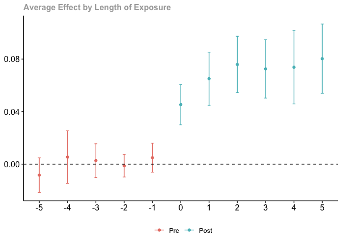
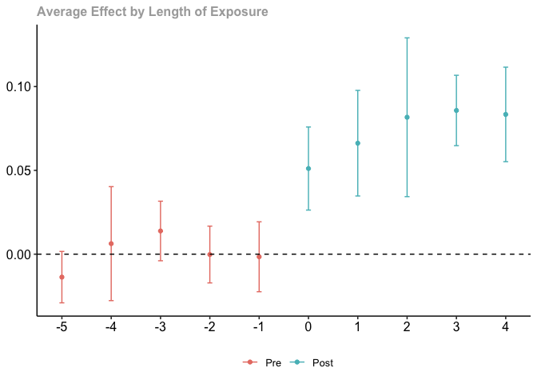

## Introduction

This exercise will help you learn about the recent DiD literature on
settings with multiple periods and staggered treatment timing. We will
examine the effects of Medicaid expansions on insurance coverage using
publicly-available data from the ACS. This analysis is similar in spirit
to that in [Carey, Miller, and Wherry
(2020)](https://www.dropbox.com/s/mgunjcebpgnb939/Carey-et-al.pdf?dl=0),
although they use confidential data.

## Data

The provided datasets `ehec_data.dta` (for Stata) and `ehec_data.csv`
(for R) contain a state-level panel dataset on health insurance coverage
and Medicaid expansion. The variable `dins` shows the share of
low-income childless adults with health insurance in the state. The
variable `yexp2` gives the year that a state expanded Medicaid coverage
under the Affordable Care Act, and is missing if the state never
expanded. The variable `year` gives the year of the observation and the
variable `stfips` is a state identifier. (The variable `W` is the sum of
person-weights for the state in the ACS; for simplicity, we will treat
all states equally and ignore the weights, although if you’d like an
additional challenge feel free to re-do everything incorporating the
population weights!)

1.  **Load the data**

Use the `readRDS()` or `use` commands in R and Stata, respectively, to
load the relevant dataset.

``` r
library(here)
```

    here() starts at /Users/kylebutts/Documents/Mixtape-Sessions/Advanced-DID

``` r
library(dplyr)
```


    Attaching package: 'dplyr'

    The following objects are masked from 'package:stats':

        filter, lag

    The following objects are masked from 'package:base':

        intersect, setdiff, setequal, union

``` r
library(did)
library(haven)
df <- read_dta(here("Exercises/Data/ehec_data.dta"))
```

2.  **Estimate the $ATT(g,t)$ using Callaway and Sant’Anna’s estimator**

Use the `attgt` function in the `did` package (R) or the XX function in
the csdid package (Stata) to estimate the group-time specific ATTs for
the outcome `dins`. I recommend using the control group “notyettreated”,
which uses as a comparison group all units who are not-yet-treated at a
given period (including never-treated units). (For fun, you’re welcome
to also try out using “nevertreated” units as the control). Hint: for R
users, you will need to replace missing values of `yexp2` to some large
number (say, 3000) for the the did package to incorporate the
never-treated units.

``` r
cs_results <- att_gt(
  yname = "dins",
  tname = "year",
  idname = "stfips",
  gname = "yexp2",
  data = df %>% mutate(yexp2 = ifelse(is.na(yexp2), 3000, yexp2)),
  control_group = "notyettreated"
)
```

    Warning in pre_process_did(yname = yname, tname = tname, idname = idname, : Be aware that there are some small groups in your dataset.
      Check groups: 2015,2016,2017,2019.

    Warning in att_gt(yname = "dins", tname = "year", idname = "stfips", gname =
    "yexp2", : Not returning pre-test Wald statistic due to singular covariance
    matrix

For R users, apply the `summary` command to the results from the
`att_gt` command. For Stata users. This should give a table with
estimates of the $ATT(g,t)$ – that is, average treatment effects for a
given “cohort” first-treated in period g at each time t. For example,
$ATT(2014,2015)$ gives the treatment effect in 2015 for the cohort first
treated in 2014.

``` r
summary(cs_results)
```


    Call:
    att_gt(yname = "dins", tname = "year", idname = "stfips", gname = "yexp2", 
        data = df %>% mutate(yexp2 = ifelse(is.na(yexp2), 3000, yexp2)), 
        control_group = "notyettreated")

    Reference: Callaway, Brantly and Pedro H.C. Sant'Anna.  "Difference-in-Differences with Multiple Time Periods." Journal of Econometrics, Vol. 225, No. 2, pp. 200-230, 2021. <https://doi.org/10.1016/j.jeconom.2020.12.001>, <https://arxiv.org/abs/1803.09015> 

    Group-Time Average Treatment Effects:
     Group Time ATT(g,t) Std. Error [95% Simult.  Conf. Band]  
      2014 2009  -0.0065     0.0048       -0.0196      0.0066  
      2014 2010   0.0111     0.0060       -0.0050      0.0273  
      2014 2011   0.0015     0.0056       -0.0137      0.0167  
      2014 2012   0.0016     0.0068       -0.0167      0.0199  
      2014 2013   0.0009     0.0071       -0.0183      0.0201  
      2014 2014   0.0467     0.0086        0.0234      0.0700 *
      2014 2015   0.0692     0.0102        0.0415      0.0969 *
      2014 2016   0.0785     0.0106        0.0497      0.1073 *
      2014 2017   0.0725     0.0110        0.0428      0.1022 *
      2014 2018   0.0738     0.0130        0.0386      0.1090 *
      2014 2019   0.0803     0.0106        0.0517      0.1090 *
      2015 2009   0.0071     0.0137       -0.0300      0.0442  
      2015 2010  -0.0245     0.0112       -0.0549      0.0060  
      2015 2011  -0.0027     0.0059       -0.0186      0.0133  
      2015 2012   0.0003     0.0036       -0.0095      0.0101  
      2015 2013  -0.0100     0.0115       -0.0410      0.0211  
      2015 2014  -0.0020     0.0072       -0.0216      0.0175  
      2015 2015   0.0491     0.0234       -0.0142      0.1124  
      2015 2016   0.0526     0.0152        0.0115      0.0937 *
      2015 2017   0.0682     0.0105        0.0396      0.0967 *
      2015 2018   0.0663     0.0127        0.0320      0.1006 *
      2015 2019   0.0738     0.0119        0.0417      0.1059 *
      2016 2009   0.0022     0.0062       -0.0145      0.0189  
      2016 2010   0.0511     0.0087        0.0276      0.0745 *
      2016 2011  -0.0262     0.0685       -0.2117      0.1593  
      2016 2012  -0.0276     0.0793       -0.2425      0.1873  
      2016 2013   0.0440     0.0799       -0.1726      0.2606  
      2016 2014  -0.0322     0.0827       -0.2562      0.1919  
      2016 2015   0.0409     0.0187       -0.0097      0.0914  
      2016 2016   0.0317     0.0106        0.0029      0.0604 *
      2016 2017   0.0368     0.0088        0.0130      0.0606 *
      2016 2018   0.0645     0.0130        0.0293      0.0997 *
      2016 2019   0.0825     0.0100        0.0554      0.1096 *
      2017 2009   0.0102     0.0027        0.0030      0.0175 *
      2017 2010  -0.0161     0.0034       -0.0254     -0.0069 *
      2017 2011   0.0019     0.0027       -0.0056      0.0093  
      2017 2012   0.0177     0.0033        0.0087      0.0267 *
      2017 2013   0.0012     0.0037       -0.0088      0.0112  
      2017 2014  -0.0063     0.0059       -0.0222      0.0097  
      2017 2015   0.0036     0.0065       -0.0141      0.0213  
      2017 2016   0.0398     0.0056        0.0247      0.0550 *
      2017 2017   0.0471     0.0054        0.0324      0.0618 *
      2017 2018   0.0681     0.0051        0.0543      0.0818 *
      2017 2019   0.0650     0.0038        0.0547      0.0753 *
      2019 2009   0.0189     0.0056        0.0038      0.0340 *
      2019 2010  -0.0269     0.0094       -0.0522     -0.0016 *
      2019 2011  -0.0244     0.0029       -0.0323     -0.0165 *
      2019 2012   0.0024     0.0261       -0.0682      0.0730  
      2019 2013   0.0129     0.0074       -0.0071      0.0330  
      2019 2014   0.0003     0.0075       -0.0201      0.0207  
      2019 2015  -0.0108     0.0089       -0.0349      0.0132  
      2019 2016  -0.0182     0.0305       -0.1009      0.0644  
      2019 2017   0.0093     0.0237       -0.0549      0.0735  
      2019 2018   0.0062     0.0066       -0.0117      0.0241  
      2019 2019   0.0365     0.0057        0.0210      0.0521 *
    ---
    Signif. codes: `*' confidence band does not cover 0

    Control Group:  Not Yet Treated,  Anticipation Periods:  0
    Estimation Method:  Doubly Robust

3.  **Compare to DiD estimates calculated by hand**

To understand how these $ATT(g,t)$ estimates are constructed, we will
manually compute one of them by hand. For simplicity, let’s focus on
$ATT(2014, 2014)$, the treatment effect for the first treated cohort
(2014) in the year that they’re treated (2014). Create an indicator
variable $D$ for whether a unit is first-treated in 2014. Calculate the
conditional mean of `dins` for the years 2013 and 2014 for units with
$D=1$ and units with $D=0$ (i.e. calculate 4 means, for each combination
of year and D). Manually compute the 2x2 DiD between D=1 and D=0 and
2013 and 2014. If you did it right, this should line up exactly with the
$ATT(g,t)$ estimate you got from the CS package! (Bonus: If you’re
feeling ambitious, you can verify by hand that the other $ATT(g,t)$
estimates from the CS package also correspond with simple 2x2 DiDs that
you can compute by hand)

``` r
# Compute the ATT(2014,2014) by hand
ytable <-
  df %>%
  filter(year %in% c(2013, 2014)) %>%
  mutate(treated = case_when(
    yexp2 == 2014 ~ 1,
    is.na(yexp2) | yexp2 > 2014 ~ 0
  )) %>%
  group_by(treated, year) %>%
  summarise(dins = mean(dins))
```

    `summarise()` has grouped output by 'treated'. You can override using the
    `.groups` argument.

``` r
with(ytable, {
  (dins[year == 2014 & treated == 1] - dins[year == 2013 & treated == 1]) - 
  (dins[year == 2014 & treated == 0] - dins[year == 2013 & treated == 0])
})
```

    [1] 0.04670243

4.  **Aggregate the $ATT(g,t)$**

We are often interested in a summary of the $ATT(g,t)$’s. In R, use the
`aggte` command with option `type = "dynamic"` to compute “event-study”
parameters. These are averages of the $ATT(g,t)$ for cohorts at a given
lag from treatment — for example, the estimate for event-time 3 gives an
average of parameters of the form $ATT(g,g+3)$, i.e. treatment effects 3
periods after units were first treated. You can use the `ggdid` command
to plot the relevant event-study.

``` r
es <- aggte(cs_results,
  type = "dynamic",
  min_e = -5, max_e = 5
)

ggdid(es)
```

<!-- -->

You can also calculate overall summary parameters. E.g, using the option
`type = "simple"` takes a simple weighted average of the $ATT(g,t)$,
weighting proportional to cohort sizes.

``` r
aggte(cs_results, type = "simple")
```


    Call:
    aggte(MP = cs_results, type = "simple")

    Reference: Callaway, Brantly and Pedro H.C. Sant'Anna.  "Difference-in-Differences with Multiple Time Periods." Journal of Econometrics, Vol. 225, No. 2, pp. 200-230, 2021. <https://doi.org/10.1016/j.jeconom.2020.12.001>, <https://arxiv.org/abs/1803.09015> 


       ATT    Std. Error     [ 95%  Conf. Int.]  
     0.068        0.0081      0.052      0.0839 *


    ---
    Signif. codes: `*' confidence band does not cover 0

    Control Group:  Not Yet Treated,  Anticipation Periods:  0
    Estimation Method:  Doubly Robust

5.  **Compare to TWFE estimates (part 1)**

Estimate the OLS regression specification
$Y_{it} = \alpha_i + \lambda_t + D_{it} \beta +\epsilon_{it}$ where
$D_{it}$ is an indicator for whether unit $i$ was treated in period $t$.
How does the estimated coefficient $\hat{\beta}$ compare to the simple
weighted average you got from Callaway and Sant’Anna? (Don’t forget to
cluster your SEs at the state level!)

``` r
library(fixest)
# Create a post-treatment indicator
df <- df %>% mutate(postTreated = !is.na(yexp2) & year >= yexp2)

# Run static TWFE, with SEs clustered at the state level
twfe_static <- feols(dins ~ postTreated | stfips + year, data = df, cluster = "stfips")
summary(twfe_static)
```

    OLS estimation, Dep. Var.: dins
    Observations: 552 
    Fixed-effects: stfips: 46,  year: 12
    Standard-errors: Clustered (stfips) 
                    Estimate Std. Error t value   Pr(>|t|)    
    postTreatedTRUE 0.070321   0.007401 9.50152 2.5169e-12 ***
    ---
    Signif. codes:  0 '***' 0.001 '**' 0.01 '*' 0.05 '.' 0.1 ' ' 1
    RMSE: 0.021082     Adj. R2: 0.93835 
                     Within R2: 0.426746

6.  **Explain this result using the Bacon decomposition**

You probably noticed that the static TWFE estimate and the
simple-weighted average from C&S were fairly similar. The reason for
that is that in this example, there are a fairly large number of
never-treated units, and so TWFE mainly puts weight on “clean
comparisons”. We can see this by using the `Bacon decomposition`, which
shows how much weight static TWFE is putting on clean versus forbidden
comparisons. In R, use the `bacon()` command to estimate the weights
that TWFE puts on each of the types of comparisons. The first data-frame
returned by the command shows how much weight OLS put on the three types
of comparisons. How much weight is put on forbidden comparisons here
(i.e. comparisons of ‘Later vs Earlier’)?

``` r
library(bacondecomp)
bacon(dins ~ postTreated,
  data = df,
  id_var = "stfips",
  time_var = "year"
)
```

                          type  weight avg_est
    1 Earlier vs Later Treated 0.14911 0.06983
    2 Later vs Earlier Treated 0.05827 0.04486
    3     Treated vs Untreated 0.79262 0.07228

       treated untreated    estimate       weight                     type
    2     2016     99999 0.082728773 0.0502256229     Treated vs Untreated
    3     2014     99999 0.074935691 0.6215420836     Treated vs Untreated
    4     2015     99999 0.046864475 0.0824014126     Treated vs Untreated
    5     2017     99999 0.102274094 0.0211889347     Treated vs Untreated
    6     2019     99999 0.030943646 0.0172650579     Treated vs Untreated
    9     2014      2016 0.050191048 0.0258975868 Earlier vs Later Treated
    10    2015      2016 0.004156228 0.0020600353 Earlier vs Later Treated
    11    2017      2016 0.031975667 0.0002942908 Later vs Earlier Treated
    12    2019      2016 0.005429020 0.0005885815 Later vs Earlier Treated
    14    2016      2014 0.054292531 0.0172650579 Later vs Earlier Treated
    16    2015      2014 0.030656579 0.0161859918 Later vs Earlier Treated
    17    2017      2014 0.077060485 0.0097115951 Later vs Earlier Treated
    18    2019      2014 0.025483405 0.0107906612 Later vs Earlier Treated
    20    2016      2015 0.041763062 0.0011771630 Later vs Earlier Treated
    21    2014      2015 0.066569262 0.0194231901 Earlier vs Later Treated
    23    2017      2015 0.063993540 0.0008828723 Later vs Earlier Treated
    24    2019      2015 0.027470457 0.0011771630 Later vs Earlier Treated
    26    2016      2017 0.014518637 0.0007847754 Earlier vs Later Treated
    27    2014      2017 0.048755447 0.0194231901 Earlier vs Later Treated
    28    2015      2017 0.008627171 0.0020600353 Earlier vs Later Treated
    30    2019      2017 0.033588931 0.0001961938 Later vs Earlier Treated
    32    2016      2019 0.090774537 0.0047086521 Earlier vs Later Treated
    33    2014      2019 0.088170864 0.0647439670 Earlier vs Later Treated
    34    2015      2019 0.061097391 0.0082401413 Earlier vs Later Treated
    35    2017      2019 0.110885473 0.0017657446 Earlier vs Later Treated

7.  **Compare to TWFE estimates (part 2)**

To see a situation where negative weights can matter (somewhat) more,
drop from your dataset all the observations that are never-treated.
Re-run the Callaway and Sant’Anna and TWFE estimates like you did before
on this modified data-set. How does the TWFE estimate compare to the
simple weighted average (or the average of the event-study coefficients)
now?

``` r
## Re-run the CS results dropping never-treated units
cs_results <- att_gt(
  yname = "dins",
  tname = "year",
  idname = "stfips",
  gname = "yexp2",
  data = df %>% filter(!is.na(yexp2)),
  control_group = "notyettreated"
)
```

    Warning in pre_process_did(yname = yname, tname = tname, idname = idname, : Be aware that there are some small groups in your dataset.
      Check groups: 0,2015,2016,2017.

    Warning in att_gt(yname = "dins", tname = "year", idname = "stfips", gname =
    "yexp2", : Not returning pre-test Wald statistic due to singular covariance
    matrix

    Warning in att_gt(yname = "dins", tname = "year", idname = "stfips", gname =
    "yexp2", : Simultaneous critical value is arguably `too large' to be realible.
    This usually happens when number of observations per group is small and/or there
    is no much variation in outcomes.

``` r
aggte(cs_results, type = "simple")
```


    Call:
    aggte(MP = cs_results, type = "simple")

    Reference: Callaway, Brantly and Pedro H.C. Sant'Anna.  "Difference-in-Differences with Multiple Time Periods." Journal of Econometrics, Vol. 225, No. 2, pp. 200-230, 2021. <https://doi.org/10.1016/j.jeconom.2020.12.001>, <https://arxiv.org/abs/1803.09015> 

        ATT    Std. Error     [ 95%  Conf. Int.]  
     0.0728        0.0107     0.0518      0.0938 *


    ---
    Signif. codes: `*' confidence band does not cover 0

    Control Group:  Not Yet Treated,  Anticipation Periods:  0
    Estimation Method:  Doubly Robust

``` r
es <- aggte(cs_results,
  type = "dynamic",
  min_e = -5, max_e = 5
)

ggdid(es)
```

<!-- -->

``` r
# Re-run TWFE dropping the never-treated units
twfe_static <- feols(dins ~ postTreated | stfips + year,
  data = df %>% filter(!is.na(yexp2)),
  cluster = "stfips"
)
summary(twfe_static)
```

    OLS estimation, Dep. Var.: dins
    Observations: 360 
    Fixed-effects: stfips: 30,  year: 12
    Standard-errors: Clustered (stfips) 
                    Estimate Std. Error t value   Pr(>|t|)    
    postTreatedTRUE 0.062817   0.007653  8.2084 4.7423e-09 ***
    ---
    Signif. codes:  0 '***' 0.001 '**' 0.01 '*' 0.05 '.' 0.1 ' ' 1
    RMSE: 0.022654     Adj. R2: 0.934671
                     Within R2: 0.200545

8.  **Run the Bacon decomposition (part 2)**

Re-run the Bacon decomposition on the modified dataset. How much weight
is put on “forbidden comparisons” now?

``` r
bacon(dins ~ postTreated,
  data = df %>% filter(!is.na(yexp2)),
  id_var = "stfips",
  time_var = "year"
)
```

                          type  weight avg_est
    1 Earlier vs Later Treated 0.71902 0.06983
    2 Later vs Earlier Treated 0.28098 0.04486

       treated untreated    estimate       weight                     type
    2     2014      2016 0.050191048 0.1248817408 Earlier vs Later Treated
    3     2015      2016 0.004156228 0.0099337748 Earlier vs Later Treated
    4     2017      2016 0.031975667 0.0014191107 Later vs Earlier Treated
    5     2019      2016 0.005429020 0.0028382214 Later vs Earlier Treated
    6     2016      2014 0.054292531 0.0832544939 Later vs Earlier Treated
    8     2015      2014 0.030656579 0.0780510880 Later vs Earlier Treated
    9     2017      2014 0.077060485 0.0468306528 Later vs Earlier Treated
    10    2019      2014 0.025483405 0.0520340587 Later vs Earlier Treated
    11    2016      2015 0.041763062 0.0056764428 Later vs Earlier Treated
    12    2014      2015 0.066569262 0.0936613056 Earlier vs Later Treated
    14    2017      2015 0.063993540 0.0042573321 Later vs Earlier Treated
    15    2019      2015 0.027470457 0.0056764428 Later vs Earlier Treated
    16    2016      2017 0.014518637 0.0037842952 Earlier vs Later Treated
    17    2014      2017 0.048755447 0.0936613056 Earlier vs Later Treated
    18    2015      2017 0.008627171 0.0099337748 Earlier vs Later Treated
    20    2019      2017 0.033588931 0.0009460738 Later vs Earlier Treated
    21    2016      2019 0.090774537 0.0227057711 Earlier vs Later Treated
    22    2014      2019 0.088170864 0.3122043519 Earlier vs Later Treated
    23    2015      2019 0.061097391 0.0397350993 Earlier vs Later Treated
    24    2017      2019 0.110885473 0.0085146641 Earlier vs Later Treated

9.  **Even bigger TWFE problems**

In the last question, you saw an example where TWFE put a lot of weight
on “forbidden comparisons”. However, the estimates from the forbidden
comparisons were not so bad because the treatment effects were
relatively stable over time (the post-treatment event-study coefficients
are fairly flat). To see how dynamic treatment effects can make the
problem worse, create a variable `relativeTime` that gives the number of
periods since a unit has been treated. Create a new outcome variable
`dins2` that adds 0.01 times `relativeTime` to `dins` for observations
that have already been treated (i.e., we add in some dynamic treatment
effects that increase by 0.01 in each period after a unit is treated).
Re-run the Callaway & Sant’Anna and TWFE estimates and the Bacon decomp
using the dataset from the previous question and the *dins*2 variable.
How do the differences between C&S and TWFE compare to before?

``` r
## Re-run the CS results dropping never-treated units and adding dynamic TEs
cs_results <- att_gt(
  yname = "dins2",
  tname = "year",
  idname = "stfips",
  gname = "yexp2",
  data = df %>%
    filter(!is.na(yexp2)) %>%
    mutate(relativeTime = year - yexp2) %>%
    mutate(dins2 = dins + pmax(relativeTime, 0) * 0.01),
  control_group = "notyettreated"
)
```

    Warning in pre_process_did(yname = yname, tname = tname, idname = idname, : Be aware that there are some small groups in your dataset.
      Check groups: 0,2015,2016,2017.

    Warning in att_gt(yname = "dins2", tname = "year", idname = "stfips", gname
    = "yexp2", : Not returning pre-test Wald statistic due to singular covariance
    matrix

``` r
aggte(cs_results, type = "simple")
```


    Call:
    aggte(MP = cs_results, type = "simple")

    Reference: Callaway, Brantly and Pedro H.C. Sant'Anna.  "Difference-in-Differences with Multiple Time Periods." Journal of Econometrics, Vol. 225, No. 2, pp. 200-230, 2021. <https://doi.org/10.1016/j.jeconom.2020.12.001>, <https://arxiv.org/abs/1803.09015> 

        ATT    Std. Error     [ 95%  Conf. Int.]  
     0.0917        0.0098     0.0724      0.1109 *


    ---
    Signif. codes: `*' confidence band does not cover 0

    Control Group:  Not Yet Treated,  Anticipation Periods:  0
    Estimation Method:  Doubly Robust

``` r
es <- aggte(cs_results,
  type = "dynamic",
  min_e = -5, max_e = 5
)

ggdid(es)
```

<!-- -->

``` r
# Re-run TWFE dropping the never-treated units and adding dynamic TEs
twfe_static <- feols(dins ~ postTreated | stfips + year,
  data = df %>%
    filter(!is.na(yexp2)) %>%
    mutate(relativeTime = year - yexp2) %>%
    mutate(dins2 = dins + pmax(relativeTime, 0) * 0.01),
  cluster = "stfips"
)
summary(twfe_static)
```

    OLS estimation, Dep. Var.: dins
    Observations: 360 
    Fixed-effects: stfips: 30,  year: 12
    Standard-errors: Clustered (stfips) 
                    Estimate Std. Error t value   Pr(>|t|)    
    postTreatedTRUE 0.062817   0.007653  8.2084 4.7423e-09 ***
    ---
    Signif. codes:  0 '***' 0.001 '**' 0.01 '*' 0.05 '.' 0.1 ' ' 1
    RMSE: 0.022654     Adj. R2: 0.934671
                     Within R2: 0.200545

``` r
bacon(dins ~ postTreated,
  data = df %>%
    filter(!is.na(yexp2)) %>%
    mutate(relativeTime = year - yexp2) %>%
    mutate(dins2 = dins + pmax(relativeTime, 0) * 0.01),
  id_var = "stfips",
  time_var = "year"
)
```

                          type  weight avg_est
    1 Earlier vs Later Treated 0.71902 0.06983
    2 Later vs Earlier Treated 0.28098 0.04486

       treated untreated    estimate       weight                     type
    2     2014      2016 0.050191048 0.1248817408 Earlier vs Later Treated
    3     2015      2016 0.004156228 0.0099337748 Earlier vs Later Treated
    4     2017      2016 0.031975667 0.0014191107 Later vs Earlier Treated
    5     2019      2016 0.005429020 0.0028382214 Later vs Earlier Treated
    6     2016      2014 0.054292531 0.0832544939 Later vs Earlier Treated
    8     2015      2014 0.030656579 0.0780510880 Later vs Earlier Treated
    9     2017      2014 0.077060485 0.0468306528 Later vs Earlier Treated
    10    2019      2014 0.025483405 0.0520340587 Later vs Earlier Treated
    11    2016      2015 0.041763062 0.0056764428 Later vs Earlier Treated
    12    2014      2015 0.066569262 0.0936613056 Earlier vs Later Treated
    14    2017      2015 0.063993540 0.0042573321 Later vs Earlier Treated
    15    2019      2015 0.027470457 0.0056764428 Later vs Earlier Treated
    16    2016      2017 0.014518637 0.0037842952 Earlier vs Later Treated
    17    2014      2017 0.048755447 0.0936613056 Earlier vs Later Treated
    18    2015      2017 0.008627171 0.0099337748 Earlier vs Later Treated
    20    2019      2017 0.033588931 0.0009460738 Later vs Earlier Treated
    21    2016      2019 0.090774537 0.0227057711 Earlier vs Later Treated
    22    2014      2019 0.088170864 0.3122043519 Earlier vs Later Treated
    23    2015      2019 0.061097391 0.0397350993 Earlier vs Later Treated
    24    2017      2019 0.110885473 0.0085146641 Earlier vs Later Treated
